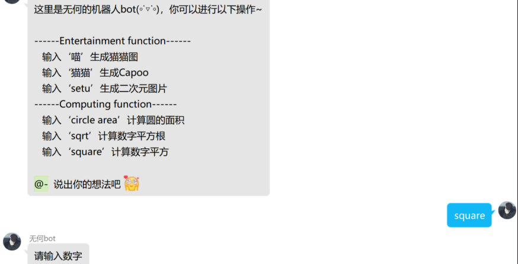
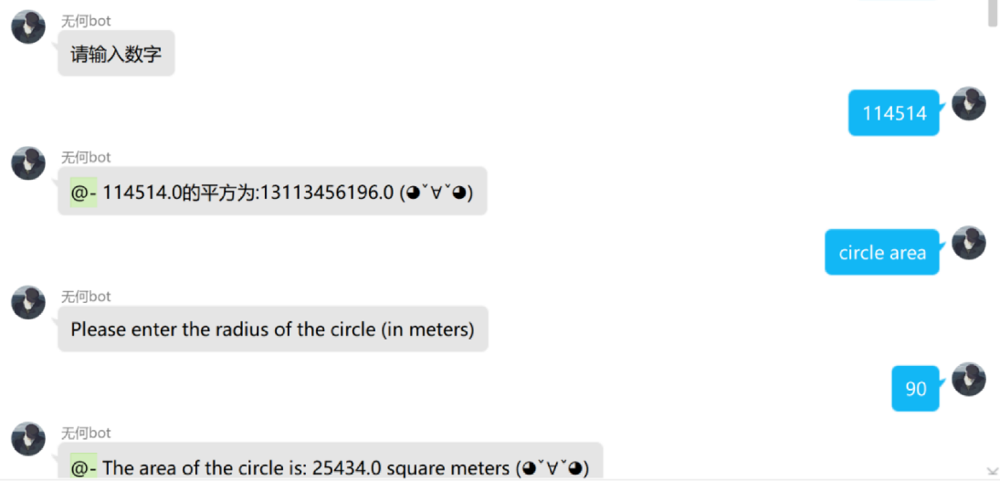

<div align="center">

# 
# Wuhebot


 「基于 [go-cqhttp](https://github.com/Mrs4s/go-cqhttp)的[OneBot](https://github.com/howmanybots/onebot) Python实现」

</div>

<p align="center">
  <a href="#">
    
  </a>
  <a href="https://github.com/ZHONGG-png/Wuhebot">
    
  </a>
  <a href="https://github.com/howmanybots/onebot/blob/master/README.md">
    
  </a>
  <a href="https://github.com/ZHONGG-png/Wuhebot/blob/main/LICENSE">
    
  </a>
</p>


---

这是一个基于**go-cqhttp**插件，遵循**onebot**标准,使用**Golang**语言实现QQ协议，并通过对**Mirai**的移植的QQ机器人插件.

感谢我的好哥们「じòぴé殇璃＂」从头到尾帮我测试.

## 目前拥有的功能

- 输入‘喵’生成猫猫图
- 输入‘猫猫’生成Capoo
- 输入‘setu’生成二次元图片
- 输入‘sqrt’计算数字平方根
- 输入‘square’计算数字平方
- 输入‘circle area’计算圆的面积

## 配置

配置信息在**config.yml**中

```yaml
{
    account: # 账号相关
    uin:  # QQ账号
    password: ''
}
```


## API

- 机器人功能纯手工打造,不过可以考虑接入GPT-3(https://platform.openai.com/)

## 编写目的

用于python学习和交流,活跃群气氛

后续还可以加入一些有趣的功能

- gif交互
- 天气预报
- 优化代码数据结构
- 调用mma实现科学计算等

加油加油~(◦˙▽˙◦)

## 示例






## Q&A
- Q:在bat文件中扫完二维码之后显示登录异常.
- A:在json文件中配置相关机器人账号密码/关掉VPN重试
- Q:文件路径报错
- A:请根据自身电脑文件所在路径更新代码中的文件路径.
- Q:机器人管理多个群通信导致异常，机器人无法响应指令.
- A:现阶段机器人只能在一个群上部署，有待改进.
- Q:在Python IDE（例如pycharm）中显示"No module named xxx".
- A:打开cmd->pip install xx ->自行下载各种第三方包.
- Q:无法导入其他的py文件.
- A:确保导入和被导入的文件在同一目录下.

#### 如有差错和改进余地，欢迎各位指点修正

## 参考文档
[1]https://github.com/botuniverse/onebot

[2]https://github.com/Mrs4s/go-cqhttp

[3]http://www.yang99.top/index.php/archives/18/

[4]https://github.com/Yang9999999/Go-CQHTTP-YesBot


